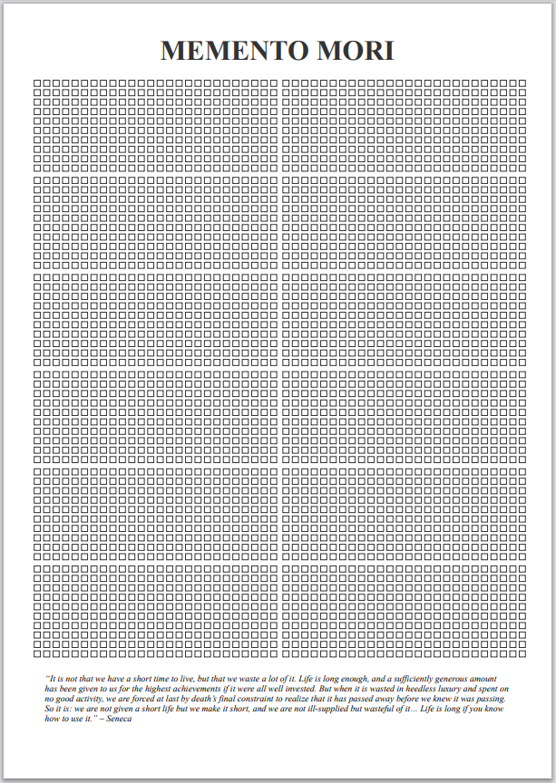

# Memento Mori Calendar

## Description

A visual reminder of life's finite nature, inspired by the Stoic practice of "Memento Mori" (Remember that you will die). This calendar represents each week of your life as a small square - filled squares show weeks you've already lived, empty ones represent your potential future.

The calendar is built with clean HTML5, CSS3, and vanilla JavaScript, featuring a minimalist design with the elegant Geist font.

> "It is not that we have a short time to live, but that we waste a lot of it..." ~ Seneca

## Preview

## Features

- Visual week-by-week representation of time
- Based on average life expectancy of 81 years
- Responsive design that works on various screen sizes
- Clean, minimalist aesthetic with Geist typography
- Current week subtly highlighted with a slow blinking animation
- Static and printable design
- No tracking, no cookies, pure client-side code

## Usage

Simply open the HTML file in a browser. The calendar automatically calculates weeks from the birthdate defined in the JavaScript file.

## License

This project is licensed under the MIT License - see the [LICENSE](LICENSE) file for details.

### Free to Share

This project is completely free to use, modify, and share. You are welcome to:
- Use it for personal or commercial purposes
- Modify and adapt it to your needs
- Share it with others
- Include it in your own projects

## Acknowledgments

Special thanks to [afonsocrg](https://github.com/afonsocrg) for the original creation of this Memento Mori Calendar project. Your work has helped many reflect on the value of time and mortality in the Stoic tradition.
